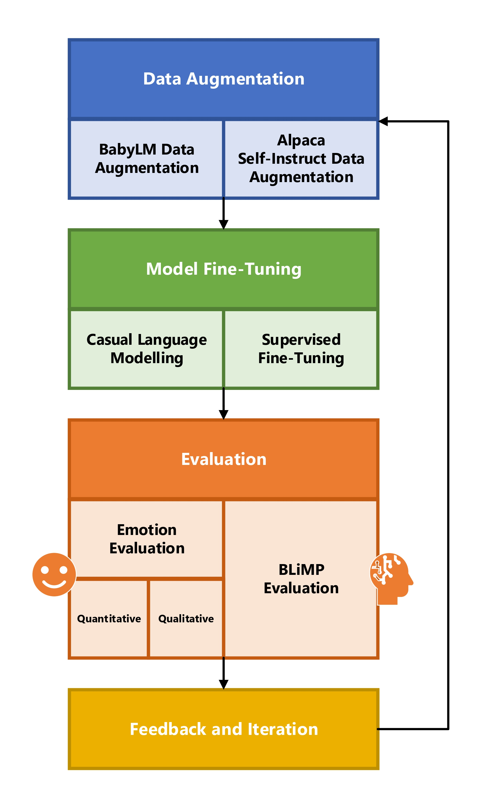

# Bridging the Emotional Gap: Enhancing Compact Language Model’s Emotional Intelligence through Targeted Fine-Tuning

## Overview
### UCL COMP0087 Statistical Natural Language Processing 2023-24 Group Project
This study explores enhancing the emotional intelligence of compact language models, such as variants of GPT-2, through systematic data augmentation, fine-tuning, and detailed evaluations using the BabyLM and Alpaca datasets. Our work integrates data processing techniques to enrich model training data with emotional depth, improving the small models' responsiveness on emotional intelligence tasks.

<div align="center">
  
</div>

## Setup and Installation
```bash
git clone https://github.com/chantomkit/COMP0087_SNLP
cd COMP0087_SNLP
pip install -r requirements.txt
```

## Key Components and Scripts
### Data Preparation and Augmentation
- **`process_pretrain_data.py`**
    - **Purpose:** Processes BabyLM data to prepare it for augmentation.
    - **Output:** Processed data files ready for augmentation.
- **`pretrain_data_augment.ipynb`**
    - **Purpose:** Augments processed data using the Mistral-7B model to enrich emotional depth.
    - **Output:** Augmented data chunks saved in `babylm_augment/`.
- **`pretrain_data_corpus.ipynb`**
    - **Purpose:** Compiles the augmented data into a final corpus, integrating additional wiki data from BabyLM to create a developmentally appropriate training dataset.
    - **Output:** Final corpus and its composition logs stored in `babylm_pretrain_corpus/`.
- **`alpaca-instruction/emotion-alpaca.py`**
    - **Purpose:** Augments alpaca-related data using the Mistral-7B model to enrich emotional granularity.
    - **Output:** Emotionally augmented alpaca data saved in `alpaca-instruction/`.

### Model Fine-Tuning and Development
- **`casual_lm.ipynb`**
   - **Purpose:** Applies causal language modeling fine-tuning using augmented BabyLM dataset to improve the generative qualities of the model in generating emotionally rich responses.
   - **Output:** Fine-tuned models ready for further development, evaluation and deployment.
- **`fine-tune/sft_instruction.ipynb`**
   - **Purpose:** Performs supervised fine-tuning on the models using the emotionally augmented Alpaca dataset.
   - **Output:** Fine-tuned models ready further development, evaluation and deployment.

Each notebook targets a different aspect of language model fine-tuning, focusing on enhancing the emotional intelligence of language models for specific data contexts. The `sft_instruction.ipynb` is used for refining response quality in instruction-based tasks using Alpaca data, while `casual_lm.ipynb` focuses on casual generative capabilities tailored to the linguistic and emotional development depicted in BabyLM data.

### Augmented Dataset Analysis
- **`prompt_analysis_babylm.ipynb`**
    - **Purpose:** Analyzes the diversity and effectiveness of prompts used in the augmented BabyLM dataset.
    - **Output:** Statistics and insights into the variation and richness of the augmented BabyLM dataset.
- **`prompt_analysis.ipynb`**
    - **Purpose:** Analyzes the diversity and effectiveness of prompts used in the augmented Alpaca dataset.
    - **Output:** Statistics and insights into the variation and richness of the augmented Alpaca dataset.

### Model Emotional Evaluation and Analysis
- **`quantitative_analysis/quantitative_analysis.ipynb`**
    - **Purpose:** Provides a quantitative assessment of model outputs, evaluating how different input emotions influence the sentiment of the outputs for both original and finetuned models.
    - **Output:** Sentiment analysis results detailing the frequency and type of sentiment outputs for each input emotion.
- **`model_analysis.ipynb`**
    - **Purpose:** Analyzes fine-tuned models, assessing enhancements in emotional intelligence from original and fine-tuned models.
    - **Output:** Comparable language model visualizations such as logit lens.


## Further Reading and References
- **[BabyLM](https://babylm.github.io/)**
- **[Alpaca](https://huggingface.co/datasets/tatsu-lab/alpaca)**
